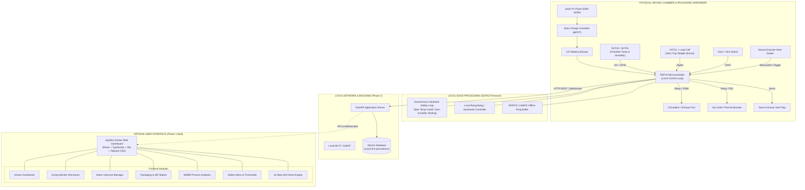
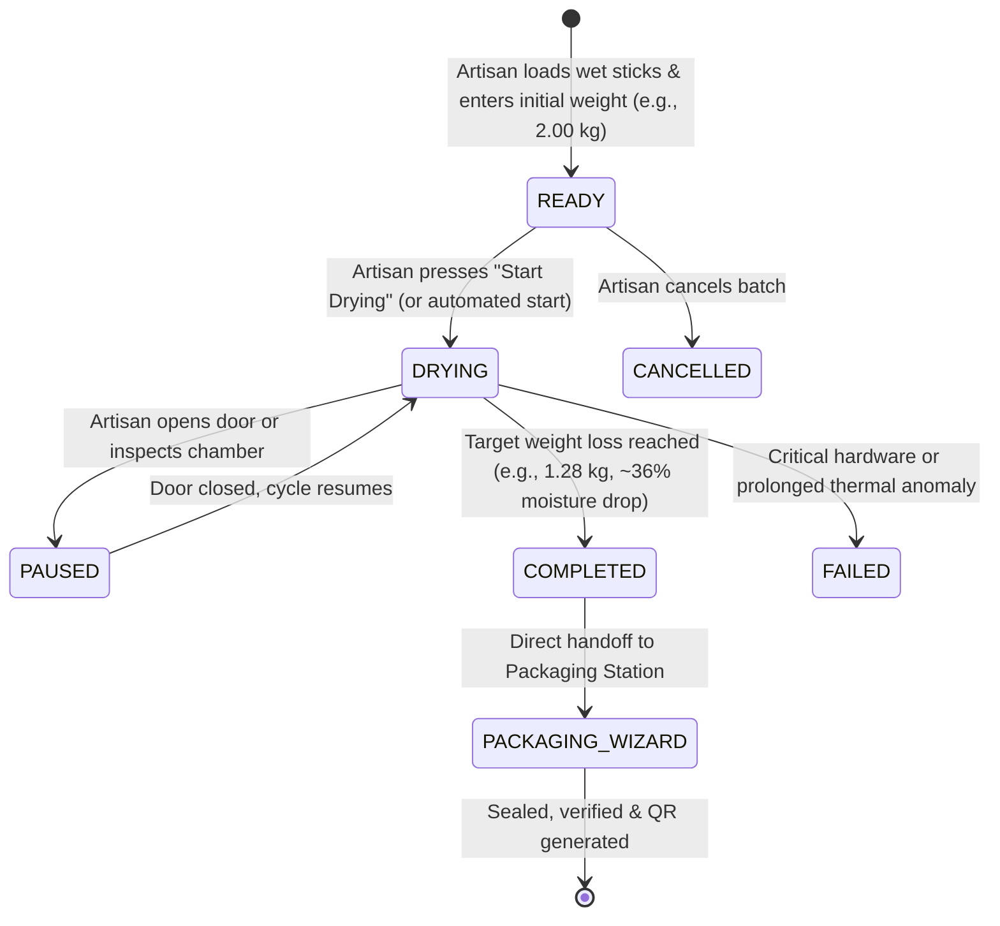
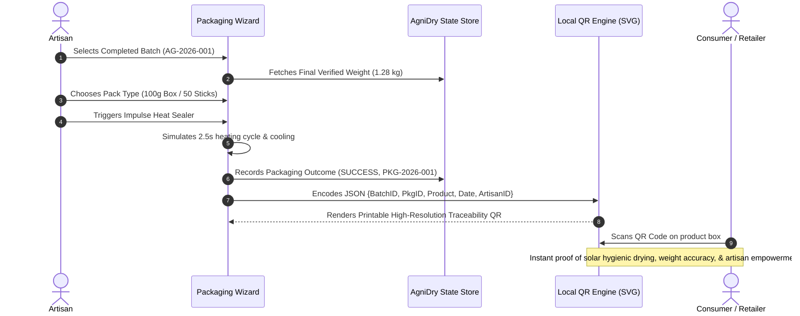

# AgniDry System Architecture Specification
**Project:** AgniDry – Smart Solar-Powered Drying & Compact Packaging System  
**SIH Problem ID:** SIH26022 | **Ministry:** Ministry of MSME  
**Category:** Hardware (Theme: Agriculture, FoodTech & Rural Development)  
**Target Beneficiaries:** Rural women artisans manufacturing incense sticks (*agarbatti*) at home

---

## 1. System Overview & Core Philosophy

AgniDry solves the critical bottleneck faced by rural home-based agarbatti makers: **unpredictable, weather-dependent open-air drying** (which causes dust contamination, stick warping, and slow turnover) and **tedious, inconsistent manual packaging**.

### Guiding Principles:
1. **Local-First Architecture**: The drying system must operate safely and autonomously on the ESP32 microcontroller even without Wi-Fi, internet, or backend availability.
2. **Artisan-Centered Design**: Clean, large-font, low-jargon interface tailored for rural women artisans with intuitive visual cues, high-contrast readouts, and multilingual support.
3. **Engineering Honesty**: Strict separation of proven prototype facts (`[FACT]`) from test assumptions (`[ASSUMPTION]`) and synthetic demonstration data (`[DEMO DATA]`). Drying progress is explicitly badged as a *"Prototype drying progress indicator"*.
4. **End-to-End Traceability**: Integrating drying weight verification directly into a compact packaging workflow with localized QR code generation for MSME market compliance.

---

## 2. End-to-End System Architecture



---

## 3. Hardware & Edge Control Layer

### 3.1 Sensor Subsystems
- **Temperature & Humidity Sensor (DHT22 / SHT31)**: Positioned inside the airflow stream of the enclosed drying cabinet to detect moisture saturation and heat buildup.
- **Drying Tray Load Cell (HX711 + 4-Wire Strain Gauge)**: Directly weighs the loaded agarbatti tray (typical raw batch: 1.5 kg – 3.0 kg). Tracks real-time moisture evaporation via weight reduction curve ($W_{\text{current}} \rightarrow W_{\text{dry}}$).
- **Solar & Battery Telemetry**: Voltage divider and current shunt (INA219) reading solar generation wattage and 12V battery state of charge (SoC).
- **Limit Switches & Enclosure Safety**: Hall-effect or microswitch checking chamber seal status.

### 3.2 Actuator Control & Safety
- **Airflow Fan**: 12V brushless DC fan regulating air velocity across sticks to prevent boundary layer moisture trapping.
- **Thermal Element**: Low-voltage PTC heating element or solar-assisted thermal air channel with automatic cutoff at $55^\circ\text{C}$ to protect stick binders and fragrance integrity.
- **Exhaust Vent Servo**: Modulates chamber relative humidity by venting wet air when humidity exceeds 65% RH during peak evaporation.
- **Local Fail-Safe Priority**:
  $$\text{Chamber Temp} > 55^\circ\text{C} \implies \text{Cut Heater, Open Vent, Run Fan 100\% (Autonomous)}$$

---

## 4. Software & Application Layer (Phase 1 Built)

### 4.1 Technology Stack
- **Framework**: React 18 with TypeScript 5
- **Build Tool**: Vite 6 (ultra-fast HMR and small production bundle)
- **Styling**: Tailwind CSS with custom solar-inspired earth tones:
  - Solar Amber (`#F59E0B` / `#D97706`)
  - Earth Terracotta (`#C2410C` / `#9A3412`)
  - Eco Green (`#15803D` / `#166534`)
  - Artisan Warm Background (`#FAF8F5`)
- **Visualizations**: Recharts with responsive multi-metric synchronized curves.
- **Icons**: Lucide React.
- **State Management**: React Context (`AgniDryContext`) with event-driven simulation and live stepping.

### 4.2 Frontend Architecture & Directory Structure

```text
agnidry/
├── docs/
│   └── architecture.md               # Complete System Architecture Specification
└── frontend/
    ├── package.json                   # Node scripts & dependencies
    ├── vite.config.ts                 # Path aliases (@/*) & local dev configuration
    ├── tailwind.config.js             # Solar earth-palette design system
    ├── tsconfig.json                  # TypeScript bundler compiler options
    ├── index.html                     # HTML5 entry with Outfit & Inter typography
    └── src/
        ├── main.tsx                   # Application entry point with BrowserRouter & AgniDryProvider
        ├── App.tsx                    # Route definitions (7 core views)
        ├── index.css                  # Custom scrollbars, artisan cards, typography
        ├── types/
        │   └── index.ts               # Core domain models (Batch, Sensor, Alert, Packaging, Device)
        ├── context/
        │   └── AgniDryContext.tsx     # Central reactive store, device state, live demo engine
        ├── mock/
        │   ├── mockData.ts            # Realistic pre-seeded batches, telemetry history & alerts
        │   └── demoEngine.ts          # 14-step SIH presentation narrative engine
        ├── utils/
        │   ├── formatters.ts          # Safe weight, date, duration, and percentage formatting
        │   └── qrGenerator.ts         # Pure offline SVG QR code generator (zero external network call)
        ├── layouts/
        │   └── AppLayout.tsx          # Top SIH Demo Bar + Header + Sidebar + Main view + Footer
        ├── components/
        │   ├── common/
        │   │   ├── Header.tsx         # Brand, Device status, Active batch pill
        │   │   ├── Sidebar.tsx        # Navigation with active states and intuitive icons
        │   │   ├── StatusBadge.tsx    # Semantic status pills (DRYING, COMPLETED, READY, etc.)
        │   │   ├── HonestyTag.tsx     # [FACT], [ASSUMPTION], [DEMO DATA], [PROTOTYPE] badges
        │   │   ├── OfflineBanner.tsx  # Artisan banner explaining autonomous ESP32 safety
        │   │   └── DemoControllerBar.tsx # Step-through, play/pause, scenario selector
        │   ├── dashboard/
        │   │   ├── SensorCard.tsx     # Large high-contrast cards (Temp, Humidity, Weight, Battery)
        │   │   ├── ActuatorCard.tsx   # Live state of Fan, Heater, and Vent
        │   │   ├── EnergyStatusCard.tsx # Solar generation status & battery voltage
        │   │   ├── CurrentBatchCard.tsx # Weight delta (2.00 kg -> 1.28 kg), duration, drying pill
        │   │   └── QuickActionGrid.tsx # Big touch buttons for starting batches and packaging
        │   ├── monitor/
        │   │   ├── SensorChart.tsx    # Multi-series telemetry curves with time window filters
        │   │   └── TelemetryTable.tsx # Timestamped chronological sensor readings
        │   ├── batches/
        │   │   ├── BatchCard.tsx      # Lifecycle card with transition buttons
        │   │   ├── CreateBatchModal.tsx # Artisan friendly form: Fragrance, Initial weight
        │   │   └── BatchDetailsModal.tsx # Batch telemetry review & stats
        │   ├── packaging/
        │   │   ├── PackagingWizard.tsx # 5-step guided packaging workflow
        │   │   ├── PackagingRecordCard.tsx # Seal outcome history (SUCCESS / FAILED)
        │   │   └── QrTraceabilityModal.tsx # Consumer QR code modal with scan preview
        │   ├── analytics/
        │   │   ├── MetricsSummary.tsx # Total Batches, Avg Drying Time, Weight Loss %
        │   │   └── AnalyticsCharts.tsx # Batch duration comparison & weight reduction trends
        │   ├── alerts/
        │   │   ├── AlertCard.tsx      # Critical/Warning/Info alerts with acknowledge button
        │   │   └── ThresholdInfo.tsx  # Transparent prototype threshold explanation box
        │   └── settings/
        │       ├── ThresholdConfig.tsx # Interactive threshold calibration
        │       ├── DeviceInfo.tsx     # ESP32 ID, Firmware v1.0.0-proto, Local IP
        │       └── ArtisanPreferences.tsx # Font scale, high-contrast, language mockup
        └── pages/
            ├── DashboardPage.tsx      # Main artisan command center
            ├── DryingMonitorPage.tsx  # Detailed drying curves & telemetry log
            ├── BatchesPage.tsx        # Batch tracking & creation
            ├── PackagingPage.tsx      # Packaging station & traceability records
            ├── AnalyticsPage.tsx      # Batch efficiency KPIs & trends
            ├── AlertsPage.tsx         # Safety events & anomaly tests
            └── SettingsPage.tsx       # Parameters & usability preferences
```

---

## 5. Data Flow & State Architecture

### 5.1 Batch Lifecycle State Machine



### 5.2 SIH 14-Step Presentation Storyline Engine
The system contains a built-in interactive presentation bar that walks evaluators through the full life of a batch:
1. **Initial Standby** (Demo Mode active, device online).
2. **Batch Initiation** (`AG-2026-001 - Mogra Agarbatti 2.00 kg` loaded).
3. **Solar & Heating Engagement** (Auxiliary heating to target $46^\circ\text{C}$).
4. **Airflow Activation** (Circulation fan moves warm dry air).
5. **Moisture Evaporation Peak** (Humidity increases temporarily to 62% RH).
6. **Vent Safety Trigger** (Exhaust vent opens to expel excess water vapor).
7. **Progressive Drying Curve** (Weight drops: $2.00\text{ kg} \rightarrow 1.75\text{ kg} \rightarrow 1.50\text{ kg}$).
8. **Live Telemetry Update** (Charts dynamically sync with sensor progression).
9. **Simulated High Humidity Anomaly** (Artisan sees safety alert and local self-correction).
10. **Target Moisture Loss Reached** (Current weight stabilizes at $1.28\text{ kg}$ -> batch marked `COMPLETED`).
11. **Packaging Wizard Handoff** (Artisan selects `Box (100g, 50 sticks)`).
12. **Impulse Sealer Simulation** (Simulated heat cycle -> seal status marked `SUCCESS`).
13. **Traceability QR Code Generation** (Offline SVG QR generated with batch & package IDs).
14. **Process Analytics Updated** (Total completed batches count increments, success rate logged).

---

## 6. Packaging & Traceability Architecture



---

## 7. Implementation Status & Next Phases

| Component | Status | Technology | Verification |
|---|---|---|---|
| **Phase 1: Artisan Frontend** | **COMPLETED** | React 18, TypeScript, Tailwind CSS, Vite 6 | Build passed (0 errors), Browser verified |
| **Phase 1: SIH Demo Engine** | **COMPLETED** | Custom 14-step state machine & scenarios | Interactive stepping, automated play |
| **Phase 1: Packaging & QR** | **COMPLETED** | Pure TypeScript offline SVG QR generator | Tested with batch handoff |
| **Phase 2: Local Backend & DB** | **COMPLETED** | Python FastAPI, SQLite, SQLAlchemy, WebSockets | 14/14 Pytest passed, persistence verified |
| **Phase 3: Hardware Simulator** | Planned | Virtual ESP32 sensor & actuator telemetry | Next immediate step |
| **Phase 4: Real ESP32 Integration**| Planned | C++ / FreeRTOS / SHT31, HX711, Wi-Fi | Pending simulator completion |
| **Phase 5: Field Validation** | Planned | Hardware enclosure & rural testing | Final SIH prototype |
